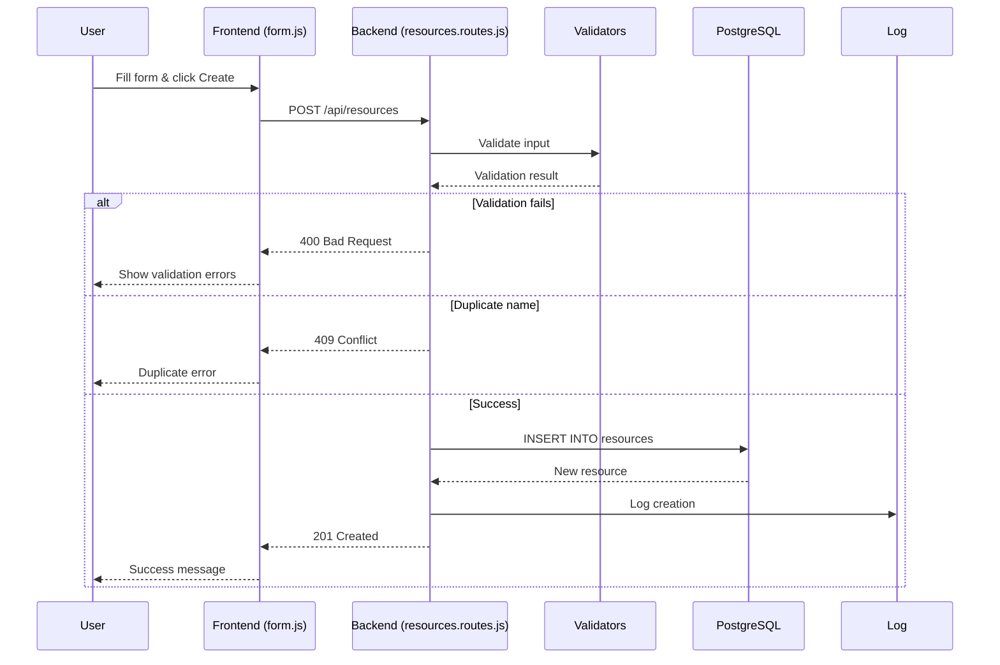
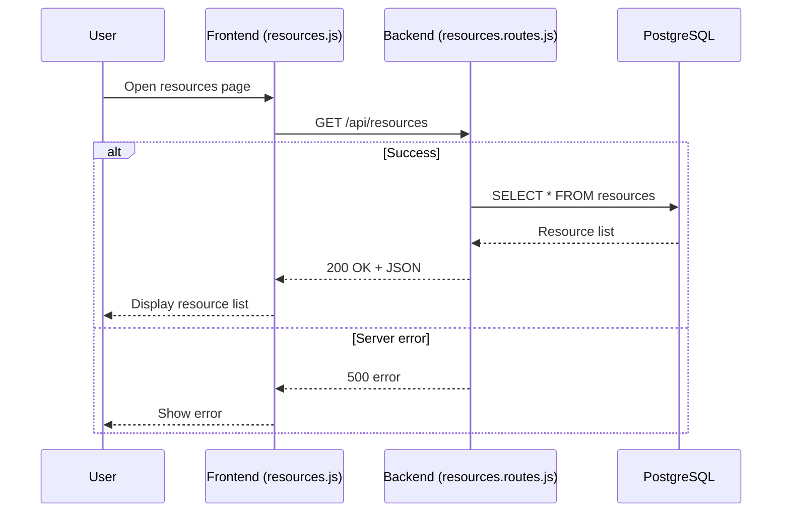
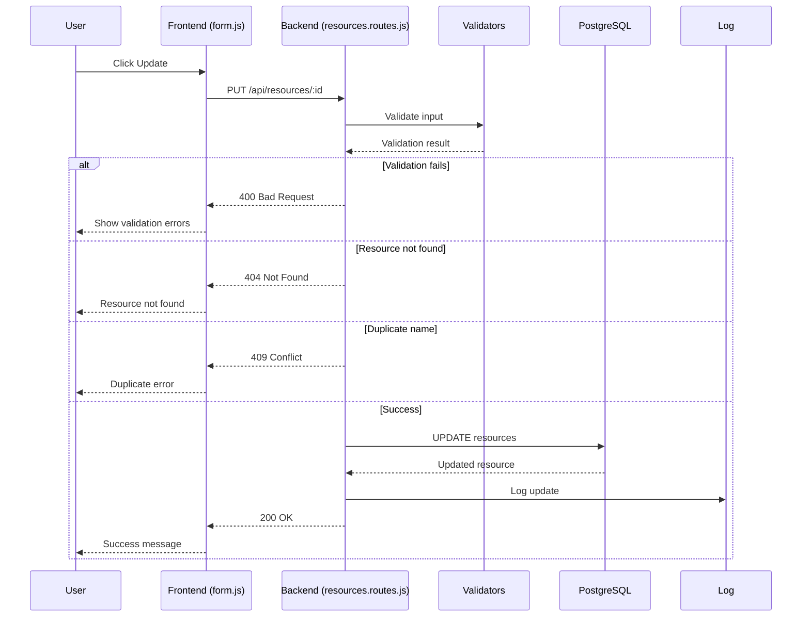
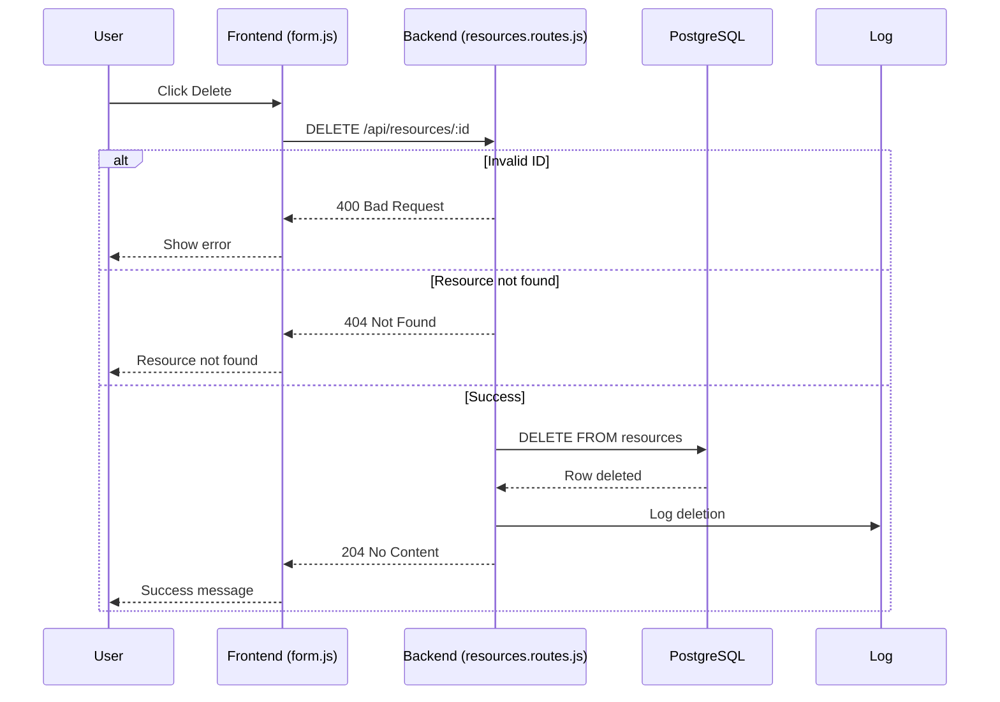

# G1 – CRUD Data Flow (Booking System Phase 6)

This document models how the Booking System handles Create, Read, Update, and Delete operations.

The flows are verified using:

* Browser Developer Tools (Network tab)
* Frontend code (resources.js, form.js)
* Backend routes (resources.routes.js)

---

# Common Participants

* **User** → Browser user interacting with UI
* **Frontend (resources.js / form.js)** → Client-side JavaScript
* **Backend (resources.routes.js)** → Express API
* **Validators (resource.validators.js)** → Input validation
* **Database (PostgreSQL)** → Stores resource data
* **Log Service (log.service.js)** → Logs events

---

# 1. CREATE Operation (C)

**Endpoint:** POST `/api/resources`
**Method:** POST
**Success Status:** 201 Created
**Error Status:** 400 (Validation), 409 (Duplicate), 500 (Server)

---

# 2. READ Operation (R)

**Endpoint:** GET `/api/resources`
**Method:** GET
**Success Status:** 200 OK
**Error Status:** 500 (Server)

---

# 3. UPDATE Operation (U)

**Endpoint:** PUT `/api/resources/:id`
**Method:** PUT
**Success Status:** 200 OK
**Error Status:** 400 (Validation), 404 (Not Found), 409 (Duplicate), 500 (Server)

---

# 4. DELETE Operation (D)

**Endpoint:** DELETE `/api/resources/:id`
**Method:** DELETE
**Success Status:** 204 No Content
**Error Status:** 400 (Invalid ID), 404 (Not Found), 500 (Server)

---
